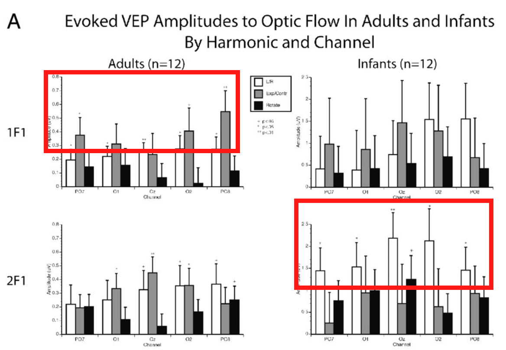
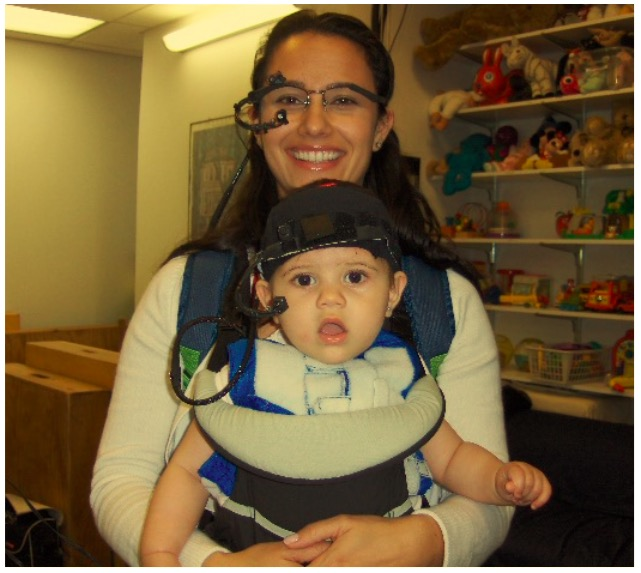
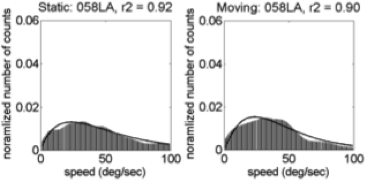

## Support

<div class="centered">


</br>


</div>

## Talk overview

- Project status report
    - The development of optic flow processing
    - *P*lay & *L*earning *A*cross a *Year* (PLAY) project
    - The *P*roximal *E*motional *E*nvironment *P*roject (PEEP)
- Toward an open, transparent, robust, and integrative developmental science

# The development of optic flow processing

## Questions about optic flow

- What is optic flow?
- Why is optic flow important?
- How does optic flow sensitivity develop?
- How do brain systems for processing optic flow develop?
- What shapes these patterns of development?
  
## Approach

- **EEG measures** of brain responses to optic flow
- **Psychophysical (behavioral) measures** of optic flow perception
- **Empirical measures** of experienced optic flow across development from head-mounted video cameras and **computer vision** analyses

## What is Optic Flow?

- Structured pattern of visual motion generated by observer movement

----

<iframe width="560" height="315" src="https://www.youtube.com/embed/o27tIdYggY0" frameborder="0" allowfullscreen></iframe>

<div class="notes">
Cute kid playing hide and seek wearing GoPro camera.
</div>

## Types of Optic Flow {.flexbox .vcenter}

<div class="centered">

</div>

---

<div class="centered">
<a href="">

</a>

[[@yu_receptive_2010]](http://doi.org/10.1152/jn.01085.2009)
</div>

<div class="notes">
Figure from Yu et al., 2010 of MSTd receptive fields.
These parse the space of different types of optic flow. You can think of them as basic features of flow.
</div>

---

<div class="centered">

</div>

## Why is optic flow important?

- Geometry of environment
    + Surface layout, orientation
    + Object motion
- Visual proprioception
    + Rotation, translation

## Flow types specify self-motion

<div class="centered">

</div>

## How Does Optic Flow Sensitivity Develop?

- Sensitivity at birth, [[@jouen_optic_2000]](10.1016/S0163-6383(01)00044-3)
- 4-6 mo-old infants: Larger brain responses to **linear** patterns,  [[@gilmore_development_2007]](http://doi.org/10.1017/S0952523807070769)

---

<div class="centered">


## How Does Optic Flow Sensitivity Develop?

- 4-6 mo-old infants: Larger brain responses to **faster** speeds/larger displacements, [[@hou_spatio-temporal_2009]](http://doi.org/10.1016/j.visres.2009.08.007)

---

<div class="centered">

</div>

## How Does Optic Flow Sensitivity Develop?

- Behavioral sensitivity to slow (linear) speeds develops slowly in macaque monkeys, [[@kiorpes_development_2004]](http://doi.org/10.1017/S0952523804216054)

---

<div class="centered">


## What about older children?

- Present: Time-varying optic flow patterns
- Measure: Steady-state visual evoked potentials (SSVEPs)
    + Event-related electro-encephalograms (EEGs)
    + Phase-locked responses at low-order harmonics
- $n=29$ 4-8 year-olds
- [[@gilmore_childrens_2016]](http://doi.org/10.1371/journal.pone.0157911)

## 2 deg/s translation {.smaller}

<div class="centered">
<video width="750" height="450" controls autoplay loop>
  <source src="https://nyu.databrary.org/slot/9825/-/asset/11635/download?inline=true" type="video/mp4">
  Your browser does not support the video tag.
</video>
</br>
<https://nyu.databrary.org/volume/75/slot/9825/->
</div>

## 4 deg/s rotation {.smaller}

<div class="centered">
<video width="750" height="450" controls autoplay loop>
  <source src="https://nyu.databrary.org/slot/9825/-/asset/11649/download?inline=true" type="video/mp4">
  Your browser does not support the video tag.
</video>
</br>
<https://nyu.databrary.org/volume/75/slot/9825/->
</div>

## 8 deg/s radial {.smaller}

<div class="centered">
<video width="750" height="450" controls autoplay loop>
  <source src="https://nyu.databrary.org/slot/9825/-/asset/11645/download?inline=true" type="video/mp4">
  Your browser does not support the video tag.
</video>
</br>
<https://nyu.databrary.org/volume/75/slot/9825/->
</div>

## [1F1 Channel-Wise Results](https://raw.githubusercontent.com/gilmore-lab/gilmore-thomas-fesi-2015/master/figs/1F1/child/figX-channel-wise-effects-1.png) {.smaller}

<div class="centered">


[[@gilmore_childrens_2016]](http://doi.org/10.1371/journal.pone.0157911)
</div>

## [1F1 Channels *p* < .0005](https://raw.githubusercontent.com/gilmore-lab/gilmore-thomas-fesi-2015/master/figs/1F1/child/figX-vector-amplitude-barplots-pattern-1.png) {.smaller}

<div class="centered">


[[@gilmore_childrens_2016]](http://doi.org/10.1371/journal.pone.0157911)
</div>

## [Complex Domain Plot of 1F1 Channels](https://raw.githubusercontent.com/gilmore-lab/gilmore-thomas-fesi-2015/master/figs/1F1/child/figX-complex-domain-plots-pattern-1.png) {.smaller}

<div class="centered">


[[@gilmore_childrens_2016]](http://doi.org/10.1371/journal.pone.0157911)
</div>

## [3F1 Channel-Wise Results](https://rawgit.com/gilmore-lab/gilmore-thomas-fesi-2015/master/figs/3F1/child/channel-wise-effects-1.png) {.smaller}

<div class="centered">


[[@gilmore_childrens_2016]](http://doi.org/10.1371/journal.pone.0157911)
</div>

## [3F1 Channels *p* < .0005](https://raw.githubusercontent.com/gilmore-lab/gilmore-thomas-fesi-2015/master/figs/3F1/child/figX-vector-amplitude-barplots-speed-1.png) {.smaller}

<div class="centered">


[[@gilmore_childrens_2016]](http://doi.org/10.1371/journal.pone.0157911)
</div>

## [Complex Domain Plot of 3F1 Channels](https://rawgit.com/gilmore-lab/gilmore-thomas-fesi-2015/master/figs/3F1/child/figX-complex-domain-plots-speed-1.png) {.smaller}

<div class="centered">


[[@gilmore_childrens_2016]](http://doi.org/10.1371/journal.pone.0157911)
</div>

## Results Summary

- Anatomical & frequency separation of responses
    + vs. pattern (lateral, 1F1)
    + speed (medial, 3F1)
- Radial & rotation $\neq$ translation
- Speed tuning (slow < med & fast)
- Similar to, but different from adults

## [Children's 1F1](https://raw.githubusercontent.com/gilmore-lab/gilmore-thomas-fesi-2015/master/figs/1F1/child/figX-channel-wise-effects-1.png) {.smaller}

<div class="centered">


[[@gilmore_childrens_2016]](http://doi.org/10.1371/journal.pone.0157911)
</div>

## [Adults' 1F1](https://raw.githubusercontent.com/gilmore-lab/gilmore-thomas-fesi-2015/master/figs/1F1/adult/figX-channel-wise-effects-1.png) {.smaller}

<div class="centered">


[[@gilmore_childrens_2016]](http://doi.org/10.1371/journal.pone.0157911)
</div>

## [Children's 3F1](https://raw.githubusercontent.com/gilmore-lab/gilmore-thomas-fesi-2015/master/figs/3F1/child/figX-channel-wise-effects-1.png) {.smaller}

<div class="centered">


[[@gilmore_childrens_2016]](http://doi.org/10.1371/journal.pone.0157911)
</div>

## [Adults' 3F1](https://raw.githubusercontent.com/gilmore-lab/gilmore-thomas-fesi-2015/master/figs/3F1/adult/figX-channel-wise-effects-1.png) {.smaller}

<div class="centered">


[[@gilmore_childrens_2016]](http://doi.org/10.1371/journal.pone.0157911)
</div>

## What about behavior?

- Time-varying optic flow
    + Radial, linear
    + {2 deg/s, 8 deg/s}
    + {5, 10, 15, 20%} coherence (adults)
    + {15, 30, 45, 60%} and {20, 40, 60, 80%} (children)
  
----

<div class="centered">

</div>

## Methods

- n=30 children (4.3–8.6 yrs, M = 6.5 yrs, 19 Female)
    + <https://nyu.databrary.org/volume/218>
- n=30 adults (18.7–23.9 yrs, M = 20.8 yrs, 16 female)
    + <http://doi.org/10.17910/B7V88T>
    + [[@adamiak_adult_2015]](http://doi.org/10.1167/15.12.1008)

## Children's responses *p*(correct)

<div class="centered">

</div>

## Adults' responses *p*(correct) {.smaller}

<div class="centered">


[[@adamiak_adult_2015]](http://doi.org/10.1167/15.12.1008)
</div>

## Speed effects in children

<div class="centered">

</div>

## Speed effects in adults {.smaller}

<div class="centered">


[[@adamiak_adult_2015]](http://doi.org/10.1167/15.12.1008)
</div>

## Pattern effects in children

<div class="centered">

</div>

## Pattern effects in adults {.smaller}

<div class="centered">


[[@adamiak_adult_2015]](http://doi.org/10.1167/15.12.1008)
</div>

## Behavioral Summary

- Children's behavior: more accurate to detect **fast** speeds, **radial** patterns
- Adults more accurate to detect **slow** speeds, **radial** patterns
- Response speeds in [children](https://rawgit.com/gilmore-lab/child-motion-psychophysics/master/group-analysis-child_files/figure-html/rt-pattern-speed-plot-1.pdf) and [adults](https://rawgit.com/gilmore-lab/adult-moco-psychophysics/master/analysis/img/plot-rt-1.png) (not shown) show similar patterns
- But, why?

## Potential factors shaping development of flow sensitivity

- External
    + Environment
- Internal
    + Posture
    + Locomotion, head, eye movements

---

<div class="centered">

</div>

## Head mounted eye tracker data from "coupled" infant/mom dyads {.smaller}

<div class="centered">

</div>

Adolph, K. (2015). Active vision in passive locomotion: real-world free viewing in infants and adults. Databrary. Retrieved February 18, 2017 from <http://doi.org/10.17910/B7.123>

## Synchronized infant and mother cams {.smaller}

<div class="centered">
<video width="640" height="480" controls autoplay>
  <source src="https://nyu.databrary.org/slot/8238/0,796163/asset/19169/download?inline=true" type="video/mp4">
  Your browser does not support the video tag.
</video>
<https://nyu.databrary.org/volume/123/slot/8238/->
<div>

---

<div class="centered"> 
<video width="640" height="480" controls>
  <source src="https://nyu.databrary.org/slot/11680/0,24500/asset/41871/download?inline=true" type="video/mp4">
  Your browser does not support the video tag.
</video>
</div>

---

<div class="centered">
<video width="640" height="480" controls>
  <source src="https://nyu.databrary.org/slot/11680/25500,50000/asset/41873/download?inline=true" type="video/mp4">
  Your browser does not support the video tag.
</video>
</div>

---

<div class="centered">
<video width="640" height="480" controls>
  <source src="https://nyu.databrary.org/slot/11680/51000,75500/asset/41875/download?inline=true" type="video/mp4">
  Your browser does not support the video tag.
</video>
</div>

## Findings {.smaller}

<div class="centered">


[[@raudies_visual_2014]](http://doi.org/10.1162/NECO_a_00645)
</div>

## Findings

- Infant (passengers) experience **faster motion speeds** than mothers
- Controlling for speed of locomotion, environment

---

<div class="centered">


</div>

## Replication

- Do the findings hold in larger samples
- When geometry of environment varies
- Outside the lab
- Across age

## Experienced flow across cultures {.smaller}

<div class="centered">
<video width="532" height="400" controls>
  <source src="https://nyu.databrary.org/slot/11630/1567557,1747248/asset/39854/download?inline=true" type="video/mp4">
  Your browser does not support the video tag.
</video>

Jayaraman, S., Smith, L.B., Raudies, F. & Gilmore, R.O. (2014). Natural Scene Statistics of Visual Experience Across Development and Culture. Databrary. Retrieved February 18, 2017 from <http://doi.org/10.17910/B7988V>

[[@gilmore_what_2015]](10.1109/DEVLRN.2015.7345450)
</div>

----

<div class="centered">


</div>

## Participant summary {.smaller}

<div class="centered">
| Country | Females | Males | Age (wks) | Coded video Hrs        |
|---------|---------|-------|-----------|------------------|
| India   | 17      | 13    | 3-63      | 3.1 (0.5-6.0) |
| U.S.    | 15      | 19    | 4-62      | 4.6 (0.2-7.6)    |

</br>
</br>
[[@gilmore_what_2015]](10.1109/DEVLRN.2015.7345450)
</div>

## Illustrative Speed Histograms - 6 weeks {.flexbox .vcenter .smaller}

<div class="centered">


[[@gilmore_what_2015]](10.1109/DEVLRN.2015.7345450)
</div>

## Illustrative Speed Histograms -- 34 weeks {.flexbox .vcenter .smaller}

<div class="centered">


[[@gilmore_what_2015]](10.1109/DEVLRN.2015.7345450)
</div>

## Illustrative Speed Histograms -- 58 weeks {.flexbox .vcenter .smaller}

<div class="centered">



[[@gilmore_what_2015]](10.1109/DEVLRN.2015.7345450)
</div>

## Pattern Correlation Results {.smaller}

<div class="centered">


[[@gilmore_what_2015]](10.1109/DEVLRN.2015.7345450)
</div>

## Conclusions: Measuring experienced flow

- Fast speeds, broad speed distributions
- Linear flow >> radial or rotational flow

## Simulating developmental change {.flexbox .vcenter .smaller}

<div class="centered">
<small>
$\begin{pmatrix}\dot{x} \\ \dot{y}\end{pmatrix}=\frac{1}{z}
\begin{pmatrix}-f & 0 & x\\ 0 & -f  & y \end{pmatrix}
\begin{pmatrix}{v_x{}}\\ {v_y{}} \\{v_z{}}\end{pmatrix}+
\frac{1}{f}
\begin{pmatrix}
xy & -(f^2+x^2) & fy\\ 
f^2+y^2 & -xy & -fy
\end{pmatrix}
\begin{pmatrix}
\omega_{x}\\ 
\omega_{y}\\ 
\omega_{z}
\end{pmatrix}$
</small>

**Geometry of environment/observer**: $(x, y, z)$</br>
**Translational speed**: $(v_x, v_y, v_z)$</br>
**Rotational speed**: $(\omega_{x}, \omega_{y}, \omega{z})$</br>
**Retinal flow**: $(\dot{x}, \dot{y})$
</div>

## Parameters For Simulation

| Parameter | Crawling Infant | Walking Infant |
|-----------|-----------------|----------------|
| Eye height| 0.30 m          | 0.60 m         |
| Locomotor speed | 0.33 m/s  | 0.61 m/s       |
| Head tilt | 20 deg          | 9 deg          |

<div class="centered">
</br>

</br>
<small>
([Kretch et al., 2014](http://dx.doi.org/10.1111/cdev.12206))
</small>
</div>

---

| Geometric Feature        | Distance |
|--------------------------|----------|
| Side wall                | +/- 2 m  |
| Side wall height         | 2.5 m    |
| Distance of ground plane | 32 m     |
| Field of view width      | 60 deg   |
| Field of view height     | 45 deg   |

## Simulating Flow Fields {.flexbox .vcenter .smaller}

<div class="centered">

</br>
<small>
([Gilmore et al, 2015](http://doi.org/10.1109/DEVLRN.2015.7345450))
</small>
</div>

---

<div class="centered">

</br>
<small>
([Gilmore et al, 2015](http://doi.org/10.1109/DEVLRN.2015.7345450))
</small>
</div>

## Simulated Flow Speeds (m/s) {.flexbox .vcenter}

<div class="centered">
| Type of Locomotion | Ground Plane | Room | Side Wall | Two Walls |
|--------------------|--------------|------|-----------|-----------|
| Crawling           | 14.41        | 14.42| 14.43     |14.62      |
| Walking            | 9.38         | 8.56 | 7.39      |9.18       |

</div>

## Summing up

- Infants commonly experience fast, linear optic flows
    + Head/eye instability
    + Proximity to ground
- Brain and behavioral responses to optic flow develop throughout childhood
    + Still immature in 5-8 year-olds
- Statistics of natural experience informative

## Some next steps

- Individual differences in flow sensitivity
- Brain responses to flow 'in the wild'
- Comparing brain responses to behavioral sensitivity
- Simulating the effects of development on visual experience
- Automating pipelines for automated analysis of 1st person videos (using PSU's Galaxy environment)

# An hour in the life...

## *P*lay & *L*earning *A*cross a *Year* project

- Play is the central context and activity of early development
- But what do parents and infants *actually do* when they 'play'?

---

<div class="centered">
<video width="750" height="500" controls autoplay>
  <source src="https://nyu.databrary.org/slot/11652/307774,376273/asset/47075/download?inline=true" type="video/mp4">
Your browser does not support the video tag.
</video>
</div>

---

<div class="centered">
<video width="750" height="500" controls autoplay>
  <source src="https://nyu.databrary.org/slot/14167/381504,4603862/asset/59930/download?inline=true" type="video/mp4">
Your browser does not support the video tag.
</video>
</div>

## *P*lay & *L*earning *A*cross a *Year* (PLAY) project

- $n=900$ infant/mother dyads; 300 @ 12-, 18-, 24-months
- 30 dyads from 30 sites across the US
- 1 hr natural activity 
    - 3 min solitary toy play 
    - 2 min dyadic toy play
    - video tour of home

## *P*lay & *L*earning *A*cross a *Year* (PLAY) project

- Videos coded for
    - [Emotional expression](https://dev1.ed-projects.nyu.edu/wikis/docuwiki/doku.php/emotion)
    - [Object interaction](https://dev1.ed-projects.nyu.edu/wikis/docuwiki/doku.php/manual3)
    - Physical activity & [locomotion](https://dev1.ed-projects.nyu.edu/wikis/docuwiki/doku.php/manual4)
    - [Transcript](https://dev1.ed-projects.nyu.edu/wikis/docuwiki/doku.php/transcription), [Communication](https://dev1.ed-projects.nyu.edu/wikis/docuwiki/doku.php/manual2), and [Gesture](https://dev1.ed-projects.nyu.edu/wikis/docuwiki/doku.php/gesture)
- Enhancements to [Datavyu](http://datavyu.org) for transcription, CHAT compatibility, Windows support

---

<div class="centered">

</div>

---

<div class="centered">

</div>

## *P*lay & *L*earning *A*cross a *Year* (PLAY) project

- Demographics + parent-report questionnaires about health, family, temperament
- Ambient sound levels

---

<div class="centered">

</div>

## *P*lay & *L*earning *A*cross a *Year* (PLAY) project

- Census block group geocoding

---

<div class="centered">

</div>

---

<div class="centered">

</div>

## *P*lay & *L*earning *A*cross a *Year* (PLAY) project

- "Big data" developmental science

---

<div class="centered">
<a href="http://doi.org/10.1002/wcs.1379">

</a>
</div>

## *P*lay & *L*earning *A*cross a *Year* (PLAY) project

- Data shared on Databrary

---

<div class="centered">
<a href="http://databrary.org">

</a>
</div>

## *P*lay & *L*earning *A*cross a *Year* (PLAY) project

- Video as data and documentation

---

<div class="centered">
<a href="http://doi.org/10.1038/s41562-017-0128">

</a>

[[@Gilmore2017-eh]](http://doi.org/10.1038/s41562-017-0128)
</div>

---

<div class="centered">
<a href="https://dev1.ed-projects.nyu.edu/wikis/docuwiki">

</a>
</div>

## What questions would *you* ask about these data?

# The *P*roximal *E*motional *E*nvironment *P*roject (PEEP)

## Guess the emotion

<!-- - <audio controls><source src="https://nyu.databrary.org/slot/12213/0,15046/asset/46757/download?inline=true" type="audio/mpeg">Your browser does not support the audio element.</audio> -->
<!-- - <audio controls><source src="https://nyu.databrary.org/slot/12212/0,15046/asset/46748/download?inline=true" type="audio/mpeg">Your browser does not support the audio element.</audio> -->

|  Sample 1   | Sample 2 |
|-----|-----|
| <audio controls><source src="https://nyu.databrary.org/slot/12213/0,15046/asset/46757/download?inline=true" type="audio/mpeg">Your browser does not support the audio element.</audio> | <audio controls><source src="https://nyu.databrary.org/slot/12212/0,15046/asset/46748/download?inline=true" type="audio/mpeg">Your browser does not support the audio element.</audio> |

## Questions

- How do children's brains respond to overheard speech with different affective prosodies?
- How do children's brains respond to different speakers?
- How do children perceive the affective qualities of overheard speech?
- What are the acoustic properties that distinguish affectively-laden speech?
- What is the natural "affective" environment

## How 'angry' are the scenarios

<div class="centered">

</div>

## How 'happy' are they?

<div class="centered">

</div>

## 'Intensity' ratings across time

<div class="centered">

</div>

# What's in common?

## Themes

- Natural environments are rich
- Perception, action, cognition & emotion inextricably linked
- Need better/denser measures
    - of environment
    - of behavior
    - of physiology

## ~~Turtles~~ networks all the way down...

<div class="centered">

</div>

---

<div class="centered">

</div>

## Power of 

- convergent evidence
- data visualization
- data, materials sharing
- to accelerate discovery...


## Limitations of

- scientific culture
- technology
- sampling diversity, sample sizes/power, publication bias, etc.
- big team science vs. small team science

# Toward an open, transparent, robust, and integrative developmental science

<!-- ## Things I can do now -->

<!-- - Keep reproducible, open, version-controlled records of my workflow -->
<!-- - Embed figures from published papers in talks or presentations -->
<!-- - Link to published papers -->

<!-- ## Things I can do now -->

<!-- - Share my work -->
<!--     - Data & materials on Databrary -->
<!--     - Code & de-identified data on [GitHub](http://github.com/gilmore-lab/) -->
<!--     - Talks & lectures on [GitHub](http://github.com/gilmore-lab/) -->
<!--     - Preprints on PsyArXiv/OSF -->

<!-- ## Things I'd like to be able to do -->

<!-- - Eliminate technical, cultural, policy barriers to more open scientific practices -->
<!-- - Link to data in published papers for new visualization & analysis -->
<!-- - See everyone's procedures, displays, analyses for myself -->
<!-- - Search for data by task, participant characteristics & download for visualization & analysis -->
<!-- - Understand how all the pieces fit together... -->

---

<div class="centered">

</div>

<div class="notes">
Now we should be envious of physicists' big toys like the Hubble Space telescope.
</div>

---

<div class="centered">
<a href="https://en.wikipedia.org/wiki/Hubble_Ultra-Deep_Field">

</a>
</div>

<div class="notes">
The Hubble allows us to look back into the history of our universe, some ~13 billion years ago.
</div>

## What would a data observatory for human development look like?

<div class="notes">
What would a similar observational instrument for peering deep into human behavior look like? I think that we have some idea already.
</div>

## Combine data from diverse domains

<div class="centered">
<a href="http://www.thehumanproject.org">

</a>
</div>

## Link measures across people

<div class="centered">
<a href="http://www.openhumans.org">

</a>
</div>

## Enable web-based data visualization, analysis

<div class="centered">
<video width="720" height="450" controls>
  <source src="mov/neurosynth-happy.mp4" type="video/mp4">
Your browser does not support the video tag.
</video>
</div>

---

<div class="centered">
<a href="http://www.socialexplorer.com/">
<div class="centered">

</div>
</a>
</div>

---

<div class="centered">
<video width="720" height="450" controls>
  <source src="mov/wordbank-vocabulary.mp4" type="video/mp4">
Your browser does not support the video tag.
</video>
</div>

## Support search, filtering by personal characteristics

<div class="centered">
<a href="http://ndar.nih.gov">

</a>
</div>

## Encourage self/active curation of data, materials

<div class="centered">

</div>

## Provide consistent, clear sharing permissions structure

<div class="centered">

</div>

## Progress

| Example | Multi-measure | Indiv link/search | Visualize | Self-curate | Permissions |
|---------|---------------|------------|-----------|-------|----|
| Databrary   | &#x2714; | &#x2714; | tabular | &#x2714; |&#x2714; |
| Human Proj  | &#x2714; | &#x2714; | ? | ? | &#x2714; |
| ICPSR       | &#x2714; | ? | &#x2714; | ? | &#x2714; |
| Neurosynth  | fMRI BOLD | group data | &#x2714; | public | NA |
| OpenNeuro   | &#x2714; |   ?       | &#x2714; | &#x2714; | public |
| Open Humans | &#x2714; | &#x2714; | ? | ? |  &#x2714; |
| OSF         | &#x2714; |          | | &#x2714; | public |
| WordBank    | M-CDI | group metadata | &#x2714; | ? | public |

## Barriers

<div class="centered">

</div>

<!-- ## Behavioral and brain systems embedded in networks -->

<!-- <div class="centered"> -->
<!--  -->
<!-- </div> -->

<!-- --- -->

<!-- <div class="centered"> -->
<!--  -->
<!-- </div> -->

## Humans are diverse

- But much (lab-based) data collected are from **W**estern, **E**ducated **I**ndustrialized, **R**ich, **D**emocratic (WEIRD) populations [Henrich et al., 2010](http://doi.org/10.1017/S0140525X0999152X)

---

<div class="centered">

</br>
<small><http://www.evoanth.net/2015/01/06/evolutionary-psychology-has-problems-and-it-isnt-getting-better/></small>
</div>

---

<div class="centered">
<a href="http://doi.org/10.1038/s41467-017-00908-7">

</a>
</div>

---

<div class="centered">


[[@LeWinn2017-lx]](http://doi.org/10.1038/s41467-017-00908-7)
</div>

## Data sensitive, hard(er) to share

- Protect participant's identities
- Protect from harm/embarrassment
- Anonymize (effective?) or get permission (many don't ask, plan to share)

---

<div class="centered">

</div>

---

> *"...psychologists tend to treat other peoples’ theories like toothbrushes; no self-respecting individual wants to use anyone else’s."*

[Walter Mischel, 2009](https://www.psychologicalscience.org/observer/becoming-a-cumulative-science)

---

> *"Reviewers and editors want novel, interesting results. Why would I waste my time doing careful direct replications?"*

Any number of researchers I've talked with

---

<div class="centered">

</div>

<div class="notes">
As a result our work, results, and methods are siloed.
</div>

---

<div class="centered">

</div>

<div class="notes">
And it often seems like we are the proverbial blind men examining the elephant.
</div>

---

<div class="centered">

</div>

<div class="notes">
We're often like like Gollum, obsessed with possessing our "precious" methods or results.
</div>

---

<div class="centered">
<a href="http://www.nature.com/articles/s41562-016-0021/figures/1">

</a>
</br>
<small>
([Munafo et al., 2017](http://doi.org/10.1038/s41562-016-0021))
</small>
</div>

<div class="notes">
This recent manifesto from Nature Human Behavior describes the risks to reproducible science at every step of the process.
I urge you to read it.
</div>

---

<div class="centered">

</div>

<div class="notes">
If each data point is a brick, a cumulative science of behavior would take each one and turn it into...
</div>

---

<div class="centered">

</div>

<div class="notes">
beautiful, intricate structures of knowledge.
So how do we build a cumulative science?
</div>

<!-- ## Metadata as "mortar" -->

<!-- <div class="centered"> -->
<!--  -->
<!-- </div> -->

<!-- <div class="notes"> -->
<!-- And on a more mundane level, we could choose and adopt common metadata items and formats that would allow us to link findings across studies. But we haven't yet. -->
<!-- </div> -->

## Let's build a Databservatory for human behavior

<div class="centered">

</div>

## It should...

- Store & share data & materials
- Link data across studies, measures
- Link across group characteristics, individuals
- Enable searching & filtering by individual characteristics, tasks, settings

---

- Support web-based data analysis, visualization; open API
- Provide consistent framework for ethical data sharing
- Enable data aggregation, cloning, provenance tracking
- Support self/active curation
- Link to publications &...

## Let us embrace [the whole elephant](http://gilmore-lab.github.io/2017-10-18-the-whole-elephant)

<div class="centered">


## Stack

This talk was produced on `r Sys.Date()` in [RStudio](http://rstudio.com) using R Markdown and the `ioslides` framework.
The code and materials used to generate the slides may be found at <https://github.com/gilmore-lab/2017-10-18-the-whole-elephant/>.
Information about the R Session that produced the code is as follows:

```{r session-info}
sessionInfo()
```

## References {.smaller}


